# Trivia Arena: The Grand Stage


Fizik motoruyla çalışan, kaotik bir 3D parti bilgi yarışması. Kırmızı kadife perdelerin, pirinç tabelaların ve dev spot ışıklarının altında küçük pelüş karakterler koşar, zıplar, birbirine omuz atar. Soruyu bilmek yetmez: doğru kapağın üstünde durman da gerekir.

- **Motor:** Godot 4.7 (Forward+, Jolt fizik)
- **Web prototipi:** `web-archive` dalında (`v1.0-web`). Bu dala dokunulmaz.
- **Tasarım belgesi:** [docs/DESIGN.md](docs/DESIGN.md)

| | |
|---|---|
| 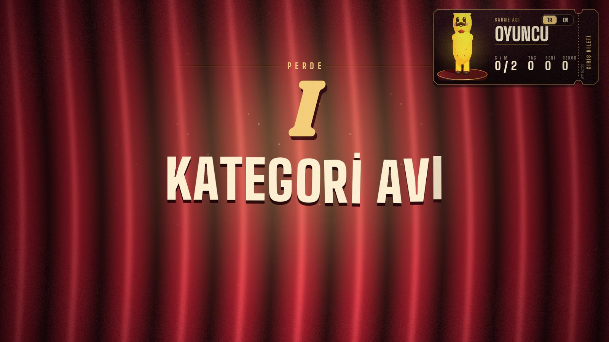 | 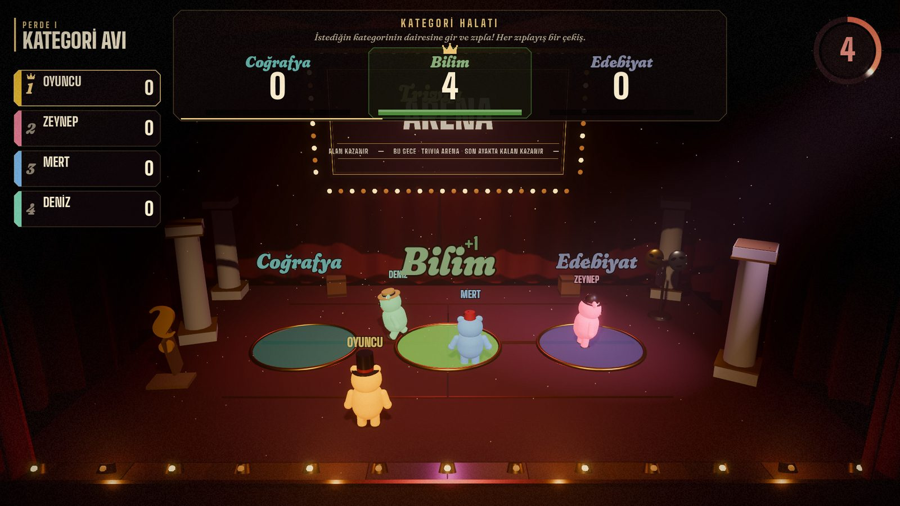 |
| **Perde kartı:** kadife perde iner, tur adı harf harf düşer | **Kategori halatı:** dairene gir, zıpla, çek |
| 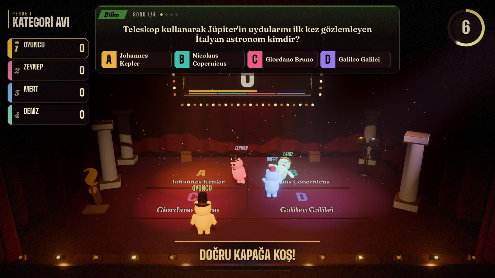 | 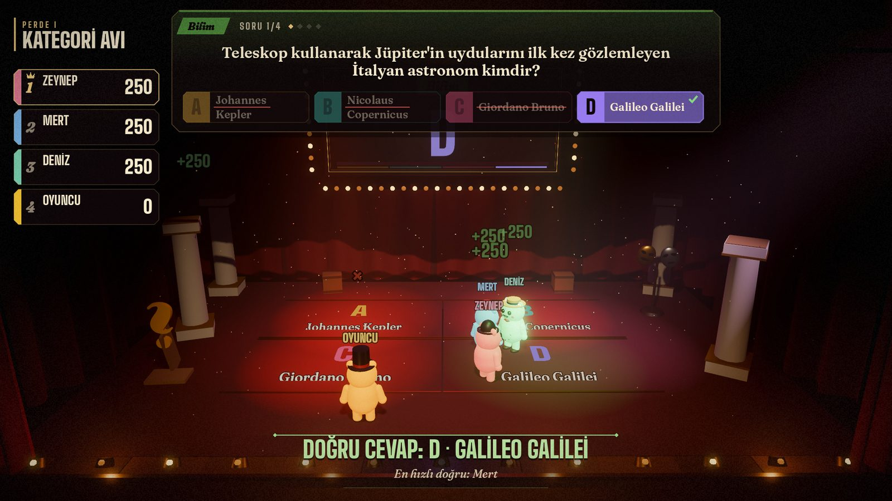 |
| **Soru:** süre bitince üstünde durduğun kapak cevabındır | **Cevap:** seri alevi, dönen puanlar |
| 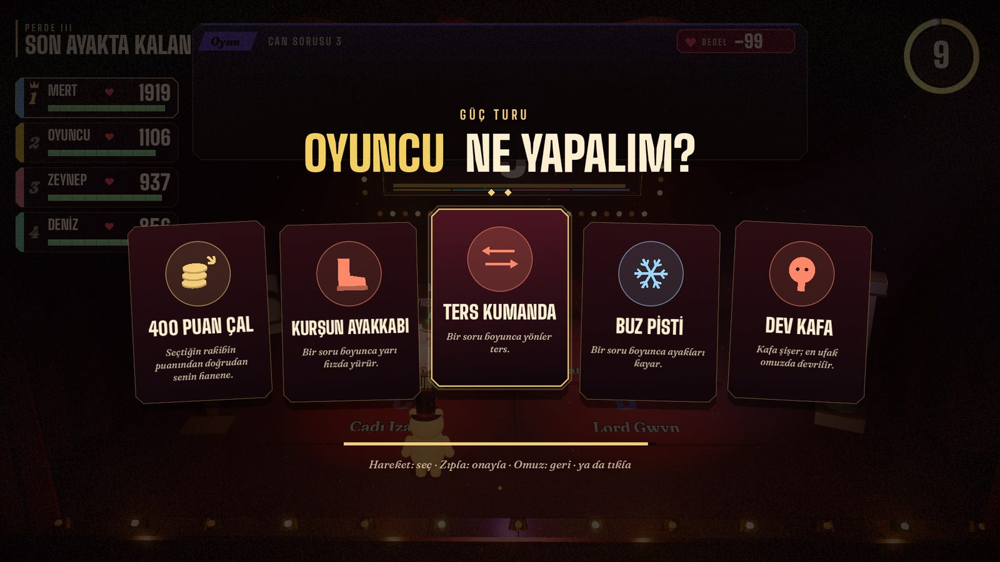 | 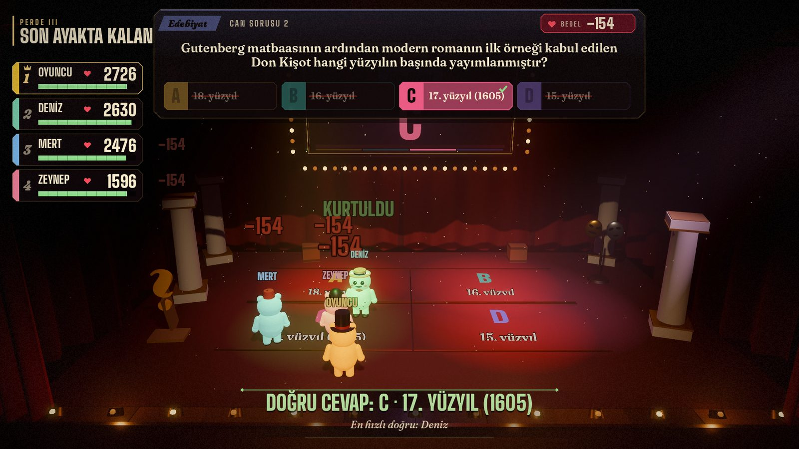 |
| **Güç turu:** en hızlı doğru 400 puan çalar ya da sabote eder | **Can turu:** yalnız en hızlı doğru kurtulur |
| 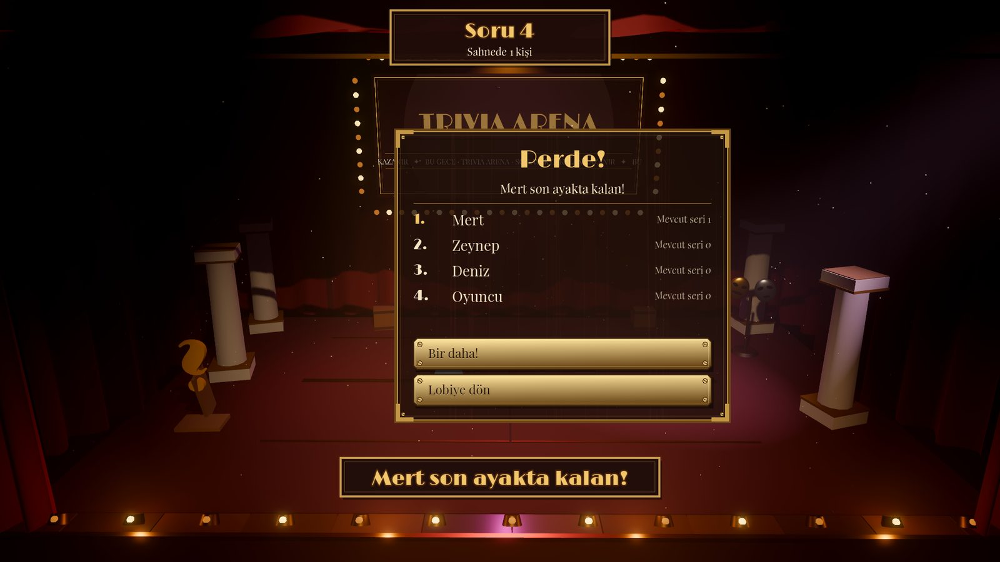 | 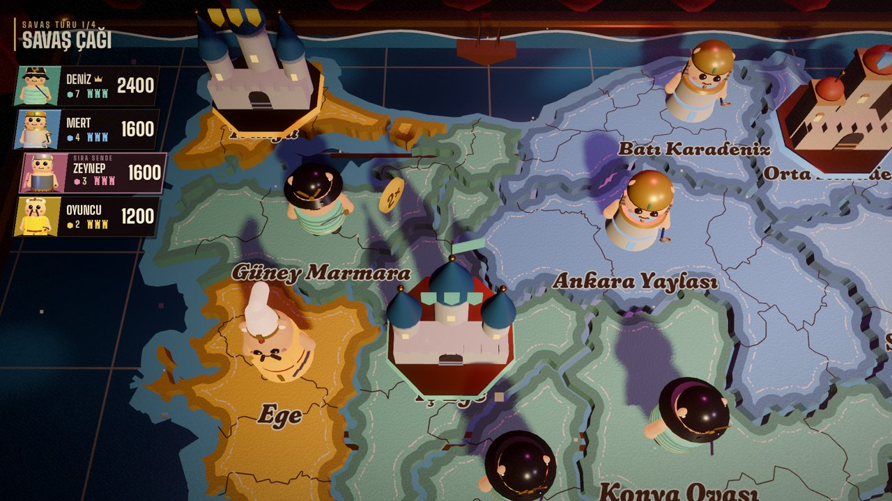 |
| **Final:** konfeti, karne, rövanş | **Conquest Quiz:** keçe Türkiye haritasında kaleler ve düellolar |
| 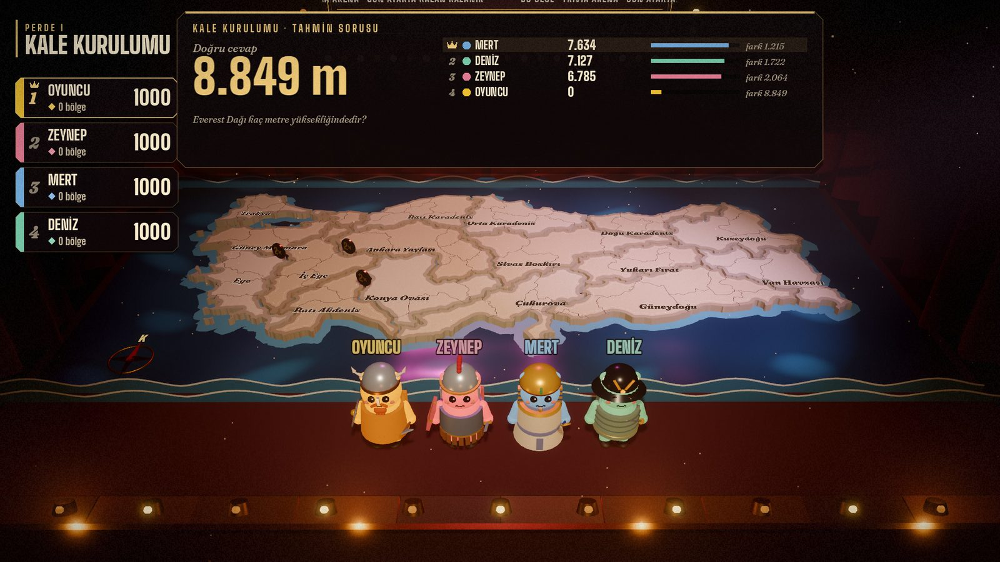 | 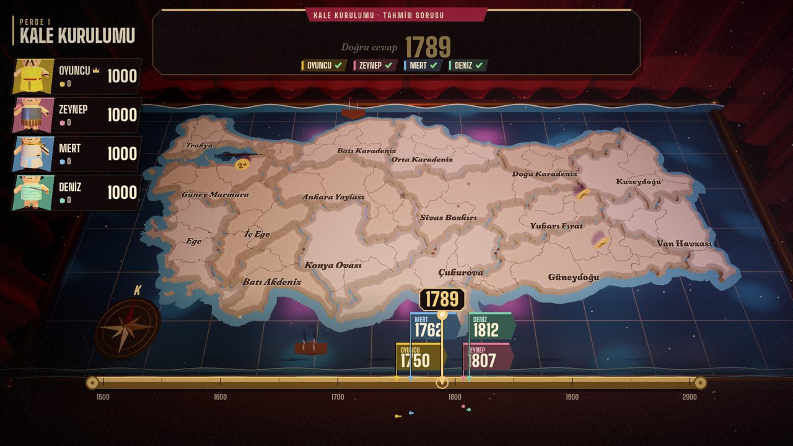 |
| **Tahmin cetveli:** herkes sancağını kaydırıp çakar | **Açıklama:** altın iğne doğru cevaba düşer, en yakına taç |
| 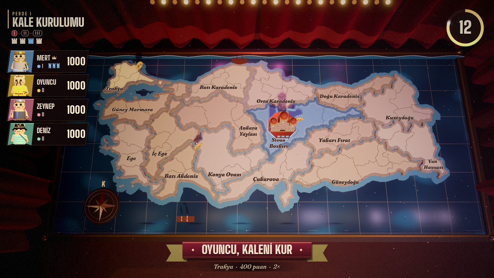 | 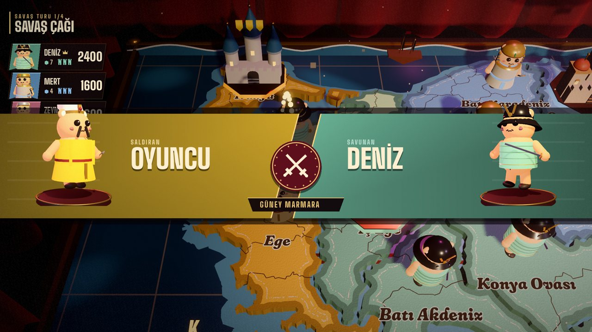 |
| **Seçim:** kamera tepeye çıkar, bölgenin değeri altta | **Düello açılışı:** saldıran ve savunan karşı karşıya |
| 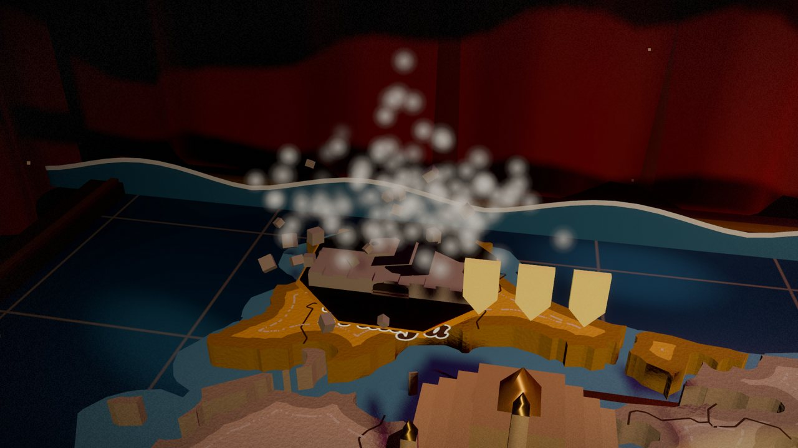 | 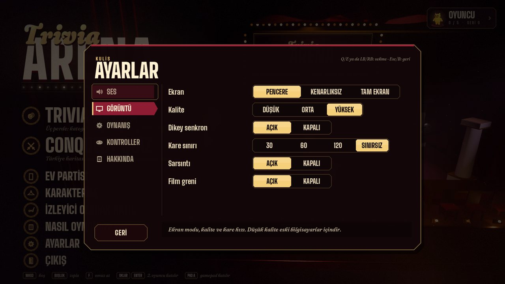 |
| **Kale düşüşü:** kamera kalenin etrafında döner | **Ayarlar:** sekmeli pano |
| 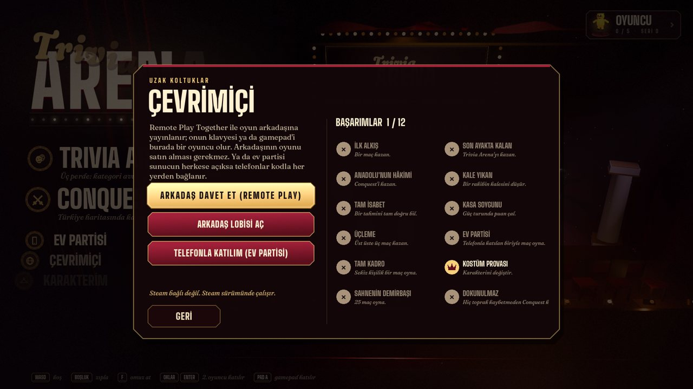 | |
| **Çevrimiçi:** Remote Play Together, lobi, başarımlar | |
| 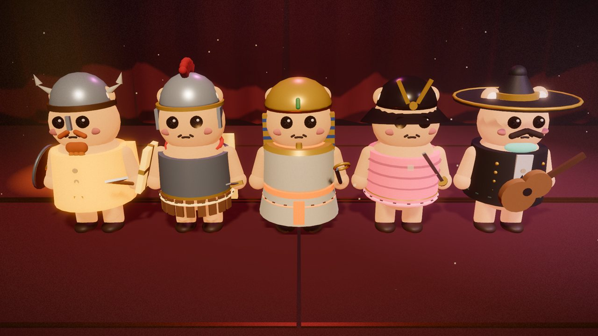 | 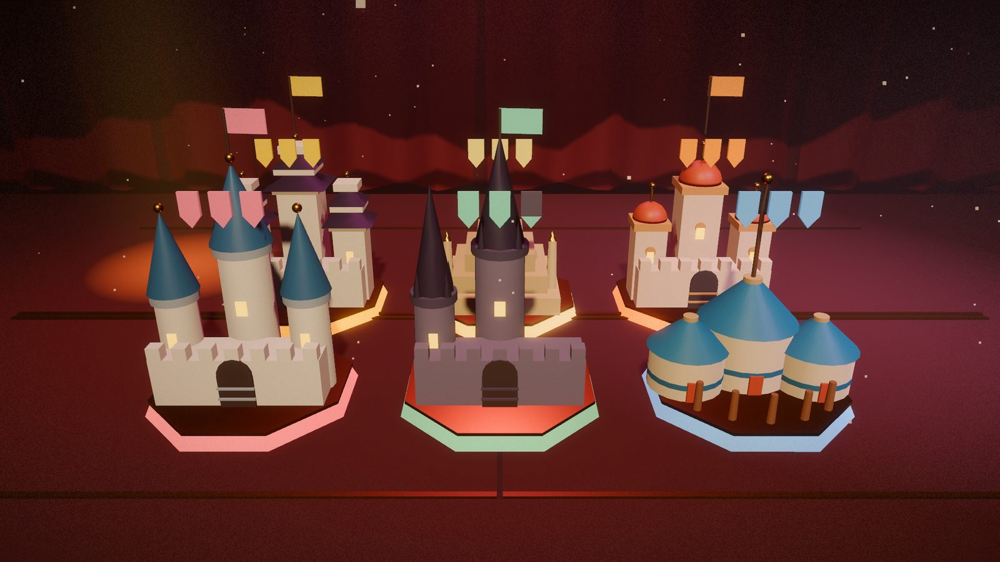 |
| **On kültür kostümü** | **Altı kale üslubu, 3 kule = 3 can** |
| 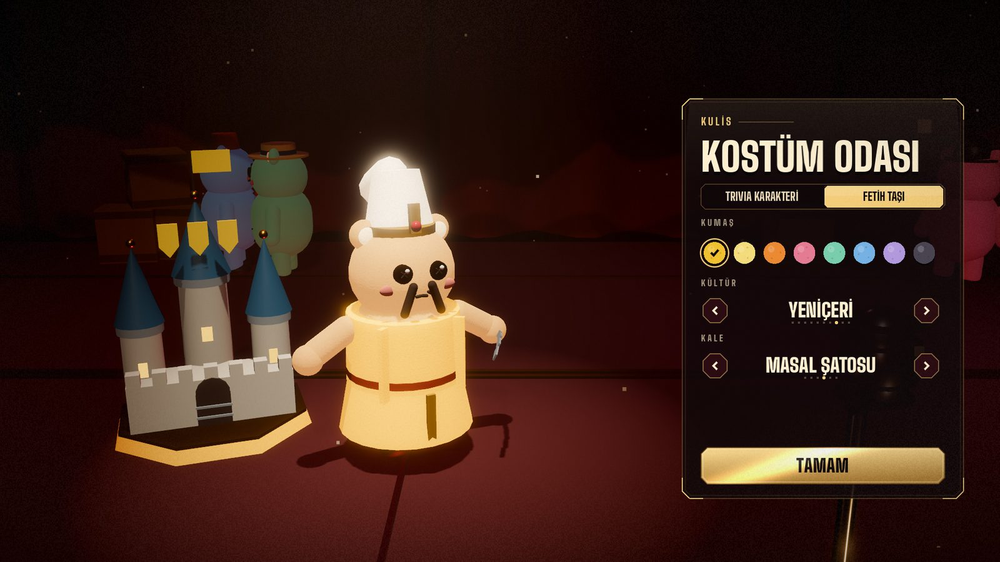 |  |
| **Kostüm odası:** Trivia ve Fetih sekmeleri | **Ev partisi:** QR'ı okut, telefonun kumanda olsun |

## Çalıştırma

1. [Godot 4.7](https://godotengine.org/download) indir. Standart sürüm yeterli, .NET gerekmez.
2. Godot'da **İçe aktar** → `game/project.godot` → **Çalıştır** (F5).

Komut satırından: `godot --path game`

## Kontroller

| Oyuncu | Koş | Zıpla | Omuz at |
|---|---|---|---|
| 1. klavye | WASD | Boşluk | F |
| 2. klavye | Oklar | Enter | Sağ Shift |
| Gamepad | Sol çubuk / d-pad | A | X ya da B |
| Telefon (Ev partisi) | Ekrandaki joystick | ZIPLA | OMUZ |

Lobide katılmak için kendi tuşuna basman yeterli. Menüler fareyle ya da klavye/gamepad odağıyla kullanılır.

## Modlar

### Trivia Arena: üç perdelik klasik şov

Kurallar web sürümündeki klasik partiyle aynıdır; bütün sayılar `game/data/rules.tres` dosyasındadır.

1. **Kategori halatı.** Her perde, sahneye inen üç kategori dairesiyle açılır. İstediğin kategorinin dairesine gir ve zıpla: her zıplayış bir çekiştir. Rakibini daireden itmek serbest. En çok çekilen kategori, o perdenin bütün sorularını belirler.
2. **Perde I · Kategori avı.** 4 soru (kolay, kolay, orta, zor). Süre bitince hangi kapağın (A-B-C-D) üstündeysen cevabın odur. Doğrular 250 · 250 · 500 · 750 diye tırmanır; yanlış seriyi sıfırlar.
3. **Perde II · Güç turu.** 4 soru. Her sorunun en hızlı doğru bileni seçer: bir rakipten 400 puan çal ya da ona bir soruluk sabotaj yap (kurşun ayakkabı, ters kumanda, buz pisti, dev kafa).
4. **Perde III · Son ayakta kalan.** Puanın cana döner (en az liderin %35'i, en az 1000). Her soruda yalnız en hızlı doğru kurtulur; diğer herkes bedel öder. Bedel her soruda büyür ve masa küçüldükçe sertleşir. Canı biten, kendi kapağından sahnenin altına düşer. Son kalan kazanır.

Yanlış cevap seni hemen oyundan atmaz; kaybettikçe can kaybedersin.

### Conquest Quiz: Bil ve Fethet

Web sürümünün planı birebir (kurulumda maç süresi: kısa / normal / uzun; düellolar çoğunlukla kolay sorulardan, tahminler herkesin kestirebileceği sorulardan), sahneye serilen keçeden dikilmiş bir Türkiye haritasında (16 bölge, gerçek il sınırları):

1. **Perde I · Kale kurulumu.** Tek bir tahmin sorusu sırayı belirler. Gerçeğe en yakın tahmin eden kalesini ilk kurar; iki kale yan yana kurulamaz. Herkes 1000 puanla başlar, her kale 3 kuledir.
2. **Perde II · Toprak paylaşımı.** Tahmin sorularında en yakın tahmin 2, ikinci 1 bölge alır (kendi sınırına komşu). Bölge 200, 2× rozetli bölge 400 puan. Boş toprak bitene kadar sürer.
3. **Perde III · Savaş çağı.** Sırayla komşu bir düşman bölgesine saldırırsın; saldıran ve savunan aynı 4 şıklı soruyu cevaplar. Yalnız saldıran bilirse bölge ve puanı el değiştirir; ikisi de bilirse tahmin sorusu ayırır. Kaleye saldırmak bir kule düşürür, son kulesi düşen elenir ve bütün toprağı fatihe geçer.

Tahminler **tahmin cetveli** ile girilir: sorunun aralığını kapsayan pirinç bir cetvel (geniş aralıklarda logaritmik). Sol/sağ sancağını kaydırır, basılı tuttukça hızlanır; yukarı/aşağı ince ayar yapar; zıplamak sancağı çakar, omuz kilidi açar. Klavyeden rakam yazmak, fareyle sürüklemek de olur. Telefonla oynayanın ekranına **sayı klavyesi**, düelloda **dört büyük şık düğmesi** gelir; telefon ve bot tahminleri açıklamaya kadar gizlidir. Bölgeler yönlerle ya da fareyle seçilir; seçimde kamera tepeye çıkar.

Generaller maç boyunca kulistedir: harita onların taşlarıyla konuşur, soldaki sancak kartlarında kostümlü canlı portreleri durur. Saldırıda kamera iki bölgeye iner, düello açılışında iki general karşı karşıya gelir; kale düşünce kamera yıkılan kalenin çevresinde döner. Finalde herkes selama çıkar.

Her oyuncunun bir **kültür kostümü** (Viking, Romalı, firavun, samuray, mariachi, silahşor, İskoç, yeniçeri, kanatlı hüsar, sınır avcısı) ve bir **kale üslubu** (Beyaz Balıkçıl, basamaklı piramit, Elhamra, masal şatosu, gotik katedral, bozkır otağı) vardır. Haritadaki her bölgede sahibinin kostümlü pelüş taşı durur.

### Müzik ve ses

Bütün müzikler notadan sentezlenir, ses örneği yoktur: lobi valsi, yarışma swingi, Conquest savaş marşı, soru sırasında gerilim yatağı ve zafer fanfarı. Müzik oyun anına göre geçiş yapar (soru gelince gerilim, cevapta geri döner). Savaş davulu, savaş borusu, kale çöküşü, orkestra vuruşu gibi efektler de aynı betikten çıkar. Değiştirmek için `game/tools/music/compose.py` içindeki notaları düzenle:

```bash
pip install numpy scipy soundfile
python3 game/tools/music/compose.py            # hepsini yeniden üret
python3 game/tools/music/compose.py conquest   # tek parça
```

### Sunucu (anlatıcı)

Sahnede bir sunucu konuşur: perde açılışları, "Tahminler gelsin!", "Düello!", "Kale düştü!", "Son beş saniye!", "Ve gecenin galibi…" gibi 29 replik, Türkçe ve İngilizce. Konuşurken müzik kısılır. Replikler `game/tools/voice/narrate.py` ile eSpeak NG + MBROLA seslerinden üretilir ve tiyatro anonsu gibi işlenir (EQ, sıkıştırma, salon yankısı). **Gerçek bir seslendirme sanatçısıyla değiştirmek için** `game/assets/audio/voice/tr|en/` altındaki dosyaları aynı adlarla değiştirmen yeter.

### Ayarlar

Ortada tek pano, beş sekme (Q/E ya da LB/RB ile geçilir):

- **Ses:** ana ses, müzik, efektler, sunucu sesi, sunucu açık/kapalı
- **Görüntü:** pencere / kenarlıksız / tam ekran, kalite (düşük: sis, SSAO ve MSAA kapanır, 3D çözünürlük %75), dikey senkron, kare sınırı, kamera sarsıntısı, film greni
- **Oynanış:** dil, tuş ipuçları, istatistikleri sıfırlama (iki kez basınca)
- **Kontroller:** klavye 1–2, gamepad, telefon tuş şeması
- **Hakkında:** sürüm ve emeği geçenler

Oyun içinde **Esc** ya da gamepad **Start** perde arası menüsünü açar (devam, ayarlar, lobiye dön, hızlı ses).

### Steam ve çevrimiçi

`scripts/core/steam_service.gd`, GodotSteam kuruluysa Steam'i kullanır; değilse oyun aynen çalışır. Kurulum ve mağaza kontrol listesi: [game/tools/steam/README.md](game/tools/steam/README.md).

- **12 başarım** (Kale Yıkan, Tam İsabet, Kasa Soygunu, Dokunulmaz…) ve istatistikler. Steam yoksa profilde tutulur, oyun içinde rozet çıkar. Listesi menüde Çevrimiçi ekranında.
- **Zengin durum:** arkadaş listesinde "Anadolu'yu fethediyor".
- **Çevrimiçi:** Remote Play Together. Oyun arkadaşına yayınlanır, onun gamepad'i sahnede bir pelüş olur (oyun zaten çok girişli). Menüde **Çevrimiçi → Arkadaş davet et** ve **Arkadaş lobisi aç**. Steam adı ilk açılışta sahne adı olur.

`game/export_presets.cfg` Windows ve Linux dışa aktarma ayarlarını içerir (çıktı `build/`).

### İlerleme: Sahne Rütbesi

Her maç XP kazandırır (`scripts/core/progress.gd`). 30 seviye ve dokuz ünvan var: Figüran, Suflör, Gardıropçu … Tiyatro Sahibi.

- **XP:**

  | Kaynak | XP |
  |---|---|
  | Katılım | 50 |
  | 1./2./3. | 120/70/40 |
  | Her doğru | 10 |
  | Conquest: her ele geçirme | 15 |
  | Conquest: her kale yıkma | 40 |
  | Trivia: çalınan her 100 puan | 5 |
  | Günün ilk galibiyeti | +100 |

- **Açılanlar:** 46 öğe. Seviyeler ve 12 başarım yeni şapka, bıyık, papyon/boyun aksesuarı, gözlük, renk, kültür kostümü, kale üslubu ve sancak deseni açar. Tablolar `progress.gd` içindeki `LEVEL_UNLOCKS` ve `ACH_UNLOCKS`.
- **Maç sonu:** sonuç ekranında rütbe paneli çıkar. Madalyon, dolan XP çubuğu, döküm, seviye atlama patlaması ve "Yeni açılanlar".
- **Karakterim:** kilitli öğeler asma kilitle ve şartıyla ("Rütbe 16'da açılır") görünür. Üstte rütbe ve XP çubuğu yer alır.

### Tur çubuğu

Sol üstte kaçıncı turda olduğunu gösteren şerit (`scripts/ui/hud/round_track.gd`). Üstte perdeler (I · II · III) var, altta o perdenin ilerlemesi:

- **Conquest 1. perde:** ipte bayraklar, her tahmin turunda biri boyanır.
- **Conquest 2. perde:** altıgenler, bölgeler sahiplerinin rengine döner.
- **Conquest 3. perde:** kaleler.
- **Trivia:** soru noktaları.

### Kayıt dosyası ve hata raporu

- **Profil:** `user://profile.json`, sürümlü (`SAVE_VERSION`). Kayıt önce geçici dosyaya yazılır, eskisi `profile.bak.json` olarak saklanır, sonra yer değiştirir. Dosya bozulursa yedekten kurtarılır. Bozuk dosya `profile.corrupt.json` olarak durur ve oyuncuya haber verilir. Eski sürüm kayıtları `_migrate()` ile güncellenir.
- **Hata raporu:** `scripts/core/error_reporter.gd`, motorun tüm hata ve uyarılarını yakalar. Oyun çökerse bir sonraki açılışta günlükten `user://reports/crash-*.txt` çıkarılır ve bildirim gösterilir. **Ayarlar → Hakkında**'da iki düğme var: "Hata raporunu kopyala" ve "Rapor klasörü". Raporlar hiçbir yere kendiliğinden gönderilmez.

### Diğerleri

- **Karakterim:** iki sekme.
  - **Trivia:** 17 şapka, 10 bıyık, 10 boyun aksesuarı, 7 gözlük, 16 renk.
  - **Fetih:** 13 kültür kostümü, 8 kale üslubu, 8 sancak deseni.
- **İzleyici:** yan duvardaki locadan izle; sahneye gül, domates ya da şapka fırlat.
- **Ev partisi:** evde tek ekran, diğer oyuncular telefonlarını kumanda olarak kullanır.

## Neyi nereden düzenlerim?

Godot'da `game/project.godot`'u aç. En sık dokunulacak yerler:

| Ne değişecek | Nereden |
|---|---|
| Süreler, puanlar, bedel formülü, sabotaj gücü | `data/rules.tres` → Inspector. Kod gerekmez. |
| Sahne düzeni (sahne, dekor, kamera, arayüz düğümleri) | `scenes/main.tscn`. Sahne, dekorlar ve kamera editörde canlı görünür. |
| Arayüz renkleri | `scripts/ui/pal.gd` (en üstteki sabitler) |
| Yazı tipleri (kalınlık, harf aralığı) | `ui/fonts/*.tres` → Inspector: `variation_opentype` (wght, opsz), `spacing_glyph` |
| Tema (metin kutuları, varsayılan yazı) | `ui/theme/grand_stage.tres` |
| Işık/parıltı efektleri | `ui/shaders/*.gdshader` (her dosyanın başında ne yaptığı yazar) |
| Arayüz parçalarını denemek | `scenes/ui_gallery.tscn`: logo, düğmeler, seçiciler; Inspector'dan metin/renk değiştir |
| Metinler (TR/EN) | `scripts/core/i18n.gd` |
| Sorular | `tools/questions/packs/*.txt` (satır başına bir soru) → `python3 game/tools/questions/build_pack.py` → `data/questions.json` |
| Kostümler | `scripts/actors/plush_visual.gd` (`HATS`, `MUSTACHES`, `BOWTIES`, `GLASSES`, `COLORS`) |
| Kilitler, XP | `scripts/core/progress.gd` |
| Bot zekâsı | `scripts/modes/classic_show.gd` (`BOT_ACC`, `BOT_READ`), `conquest_war.gd` (`BOT_ACC`, `BOT_SPREAD`) |
| Conquest sayıları (puan, süreler) | `scripts/modes/conquest_war.gd` → `CFG` |
| Kaleler, kostümler | `scripts/conquest/castle_model.gd`, `culture_costume.gd` (her üslup tek bir `match` dalı) |
| Harita | `data/maps/turkiye.json` (bölgeler, komşuluklar); görünüş `scripts/conquest/map_board.gd` |

Denemek için kısayollar (komut satırı, `--` sonrasına):

```bash
godot --path game -- --round=3            # Trivia'yı doğrudan can turundan başlat
godot --path game -- --ff=2               # bekleme sürelerini yarıya indir
godot --path game -- --timescale=2        # bütün oyunu hızlandır
```

## Ev partisi sunucusu (telefon kumandası)

Telefonlar oyuna küçük bir Node sunucusu üzerinden bağlanır (`server/`).

```bash
cd server
npm install
npm start            # http://localhost:3000  (kumanda: /pad, QR: /qr.png, WS: /ws)
```

Oyunda **Ev partisi**'ne tıkla. Açılan kartta sunucu adresini gir (yerelde `ws://localhost:3000/ws`, yayında `wss://<adres>/ws`) ve **Bağlan**'a bas. Kartta QR ve 4 harfli kod çıkar.

Evdeki telefonların PC'ye erişebilmesi için yerel ağ adresini kullan (ör. `ws://192.168.1.20:3000/ws`) ya da sunucuyu yayına al:

**Render'da yayın (ücretsiz):** Yeni bir *Web Service* aç ve bu repoyu bağla.

| Ayar | Değer |
|---|---|
| Root Directory | `server` |
| Build Command | `npm install` |
| Start Command | `npm start` |

Uyumasın diye `https://<adres>/healthz` adresini 5 dakikada bir yoklayan bir izleyici kur (UptimeRobot, cron-job.org).

> Web prototipini yayındaki Render servisinde tutmak için o servisin dalını `web-archive` yap.

## Testler

```bash
godot --headless --path game --import                  # ilk seferde
godot --headless --path game res://tests/tests.tscn    # çıkış kodu = kalan test sayısı
godot --headless --path game -s res://tools/check_scripts.gd   # bütün betikleri derle
```

Testlerin kapsamı:

- Sözlük, soru bankası ve profil karnesi.
- Kayıt dosyası: sürüm göçü, yedek, bozuk dosyadan kurtarma. Hata raporlayıcı. Rütbe/XP/kilitler. Tur çubuğu.
- Kurallar: kombo merdiveni, tur 3 bedel formülü, zorluk sırası.
- Pelüş fiziği: koşma, zıplama, omuz yiyip devrilme ve kalkma, düşünce elenme.
- Sahne kurulumu ve kapaktan düşme.
- Botlarla baştan sona tam bir klasik şov (halat, soygun/sabotaj, can turu, ölüm) ve tam bir Conquest maçı.

Telefon kumandasının uçtan uca testi: sunucuyu çalıştır, sonra `godot --headless --path game res://tests/phone_host.tscn -- --relay=ws://localhost:3000/ws`.

Ekran görüntüsü aracı:

```bash
godot --path game -- --shot=lobby,setup,arena_intro,arena_tug,arena_q,arena_open,result --shotdir=/tmp/shots --timescale=2
```

## Klasörler

```
game/
  scenes/main.tscn        oyunun sahne ağacı (Stage, Props, Actors, Camera, UI)
  scenes/ui_gallery.tscn  arayüz parçaları vitrini
  data/rules.tres         bütün oyun sayıları
  data/questions.json     ~2000 çift dilli soru, 15 kategori × kolay/orta/zor (+ 98 tahmin sorusu)
  ui/fonts/               yazı tipi ayarları (Big Shoulders, Fraunces)
  ui/theme/               Godot teması
  ui/shaders/             parıltı, ampul, halka sayaç, kadife perde, gren, spot
  scripts/core/           dil (TR/EN), profil ve karne, soru bankası, kurallar, kodla üretilen sesler
  scripts/stage/          sahne, perdeler, ışık, kapaklar, dekorlar
  scripts/actors/         pelüş fizik + görünüş, kontrolcüler (klavye, gamepad, telefon, bot)
  scripts/camera/         balkon kamerası
  scripts/modes/          Trivia Arena (classic_show.gd), Conquest (conquest_war.gd)
  scripts/conquest/       harita tahtası, kaleler, kültür kostümleri, taşlar
  data/maps/turkiye.json  Conquest haritası (web sürümünden)
  scripts/ui/             arayüz: pal.gd (renk/yazı), fx.gd (hareket), icons.gd (simgeler)
    components/           logo, menü satırı, düğmeler, seçiciler, profil kartı, 3D portre
    screens/              lobi menüsü, kostüm odası, ev partisi, loca, afiş
    hud/                  skor şeridi, soru kartı, sayaç, halat, perde kartı, ödül, final
  scripts/net/            telefon köprüsü
  tests/                  başsız testler
  tools/                  betik derleme denetimi, soru paketleri (questions/), müzik ve anlatıcı üretimi
server/                   telefon kumandası sunucusu (Node, ws)
docs/                     tasarım belgesi, ekran görüntüleri
```

## Lisanslar

Yazı tipleri SIL Open Font License altındadır (`game/assets/fonts/OFL-*.txt`): Big Shoulders, Fraunces. Bütün modeller, dokular ve sesler çalışma anında kodla üretilir.
