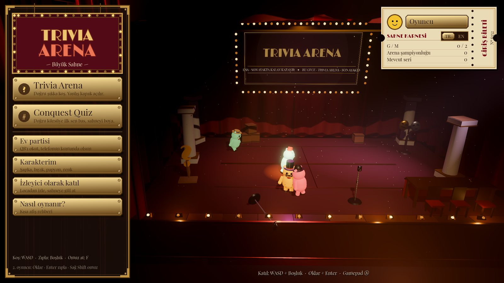
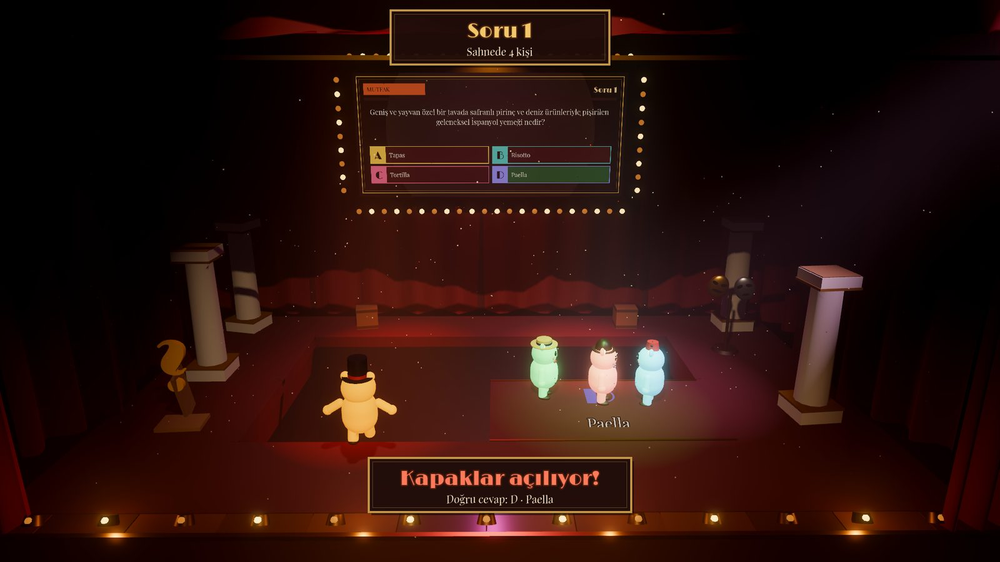
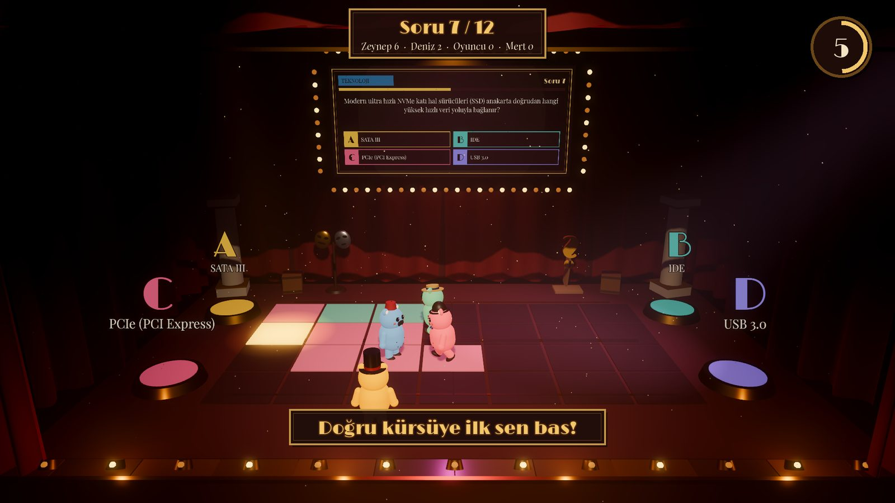
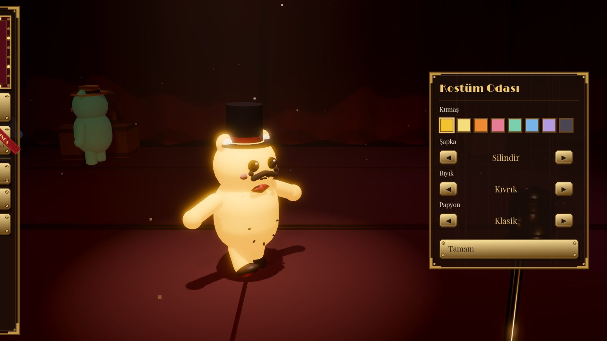
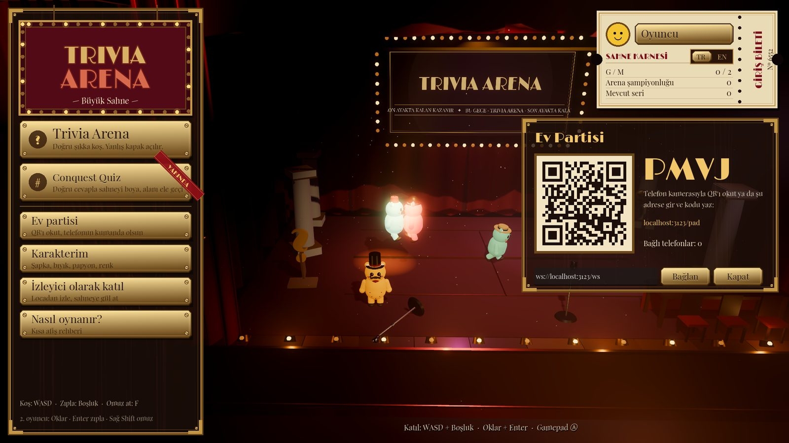

# Trivia Arena: The Grand Stage



Fizik motoruyla beslenen, kaotik bir 3D parti bilgi yarışması. Kırmızı kadife perdelerin, pirinç tabelaların ve dev spot ışıklarının altında küçük pelüş karakterler koşar, zıplar, birbirine omuz atar. Soruyu bilmek yetmez; doğru kapakta ayakta kalman da gerekir.

- **Motor:** Godot 4.7 (Forward+, Jolt fizik)
- **Sürüm:** `v0.1.0-3d-stage`
- **Web prototipi:** `web-archive` dalında (`v1.0-web`)
- **Tasarım belgesi:** [docs/DESIGN.md](docs/DESIGN.md)

| | |
|---|---|
|  |  |
| **Trivia Arena:** yanlış kapaklar açılır, üstündekiler kuyuya düşer | **Conquest Quiz:** doğru kürsüye ilk basan karoyu boyar |
|  |  |
| **Kostüm odası:** şapka, bıyık, papyon, kumaş | **Ev partisi:** QR'ı okut, telefonun kumanda olsun |

## Çalıştırma

1. [Godot 4.7](https://godotengine.org/download) indir. Standart sürüm yeterli; .NET gerekmez.
2. Godot'da **İçe aktar** → `game/project.godot` → **Çalıştır** (F5).

Komut satırından: `godot --path game`

## Kontroller

| Oyuncu | Koş | Zıpla | Omuz at |
|---|---|---|---|
| 1. klavye | WASD | Boşluk | F |
| 2. klavye | Oklar | Enter | Sağ Shift |
| Gamepad | Sol çubuk / d-pad | Ⓐ | Ⓧ ya da Ⓑ |
| Telefon (Ev partisi) | Ekrandaki joystick | ZIPLA | OMUZ |

Lobide katılmak için kendi tuşuna basman yeterli. Menüler fareyle kullanılır.

## Modlar

- **Trivia Arena:** Soru dev panoya düşer, zemin A-B-C-D kapaklarına bölünür. Süre bitmeden doğru kapağa koş. Yanlış kapaklar açılır, hiçbir kapakta durmayanı vodvil kancası kulise çeker. Son ayakta kalan kazanır.
- **Conquest Quiz:** 28 karolu sahnede her soru bir hedef karoyu parlatır. Doğru kürsüye ilk basan onu kendi rengine boyar; yanlış kürsü çarpar. Kendi renginde hızlanır, rakibin boyasında yavaşlarsın. 12 sorunun sonunda en çok karo kazanır.
- **Karakterim:** Sahnenin ortasında tek spotun altında kostüm seçimi.
- **İzleyici:** Yan duvardaki locadan izle, sahneye gül, domates ya da şapka fırlat.
- **Ev partisi:** Evde tek ekran; diğer oyuncular telefonlarını kumanda olarak kullanır.

## Ev partisi sunucusu (telefon kumandası)

Telefonlar oyuna küçük bir Node sunucusu üzerinden bağlanır (`server/`).

```bash
cd server
npm install
npm start            # http://localhost:3000  (kumanda: /pad, QR: /qr.png, WS: /ws)
```

Oyunda **Ev partisi** plaketine tıkla. Açılan kartta sunucu adresini gir (yerelde `ws://localhost:3000/ws`, yayında `wss://<adres>/ws`) ve **Bağlan**'a bas. Kartta QR ve 4 harfli kod çıkar.

Evdeki telefonların PC'ye erişebilmesi için yerel ağ adresini kullan (ör. `ws://192.168.1.20:3000/ws`) ya da sunucuyu yayına al:

**Render'da yayın (ücretsiz):** Yeni bir *Web Service* aç ve bu repoyu bağla.

| Ayar | Değer |
|---|---|
| Root Directory | `server` |
| Build Command | `npm install` |
| Start Command | `npm start` |

Uyumasın diye `https://<adres>/healthz` adresini 5 dakikada bir yoklayan bir izleyici kur (UptimeRobot, cron-job.org).

> Web prototipini yayındaki Render servisinde tutmak için o servisin dalını `web-archive` yap.

## Testler

```bash
godot --headless --path game --import                  # ilk seferde
godot --headless --path game res://tests/tests.tscn    # 47 test; çıkış kodu = kalan test sayısı
```

Testlerin kapsamı:

- Sözlük, soru bankası (1200 soru) ve profil karnesi.
- Pelüş fiziği: koşma, zıplama, omuz yiyip devrilme ve kalkma, düşünce elenme.
- Sahne kurulumu ve kapaktan düşme.
- Botlarla baştan sona tam bir Trivia Arena maçı ve tam bir Conquest maçı.

Telefon kumandasının uçtan uca testi için: sunucuyu çalıştır, sonra `godot --headless --path game res://tests/phone_host.tscn -- --relay=ws://localhost:3000/ws` komutunu ver. Oda kodunu `/tmp/ta_code.txt`'ye yazar, katılan telefonun pelüşünün hareketini ölçer.

Ekran görüntüsü aracı:

```bash
godot --path game -- --shot=lobby,setup,wardrobe,howto,arena_q,arena_open,result --shotdir=/tmp/shots --timescale=3
```

## Klasörler

```
game/                 Godot projesi
  scripts/core/       dil (TR/EN), profil ve karne, soru bankası, kodla üretilen sesler
  scripts/stage/      sahne, perdeler, ışık, kapaklar, dekorlar
  scripts/actors/     pelüş fizik + görünüş, kontrolcüler (klavye, gamepad, telefon, bot)
  scripts/camera/     balkon kamerası
  scripts/ui/         diegetik arayüz (pirinç, ahşap, bilet, afiş), soru panosu
  scripts/modes/      Trivia Arena, Conquest Quiz
  scripts/net/        telefon köprüsü
  data/questions.json 1200 çift dilli soru (+ 34 tahmin sorusu)
  tests/              başsız testler
server/               telefon kumandası sunucusu (Node, ws)
docs/                 tasarım belgesi, ekran görüntüleri
```

## Lisanslar

Yazı tipleri SIL Open Font License altındadır (`game/assets/fonts/OFL-*.txt`): Limelight, Playfair Display. Bütün modeller, dokular ve sesler çalışma anında kodla üretilir.
