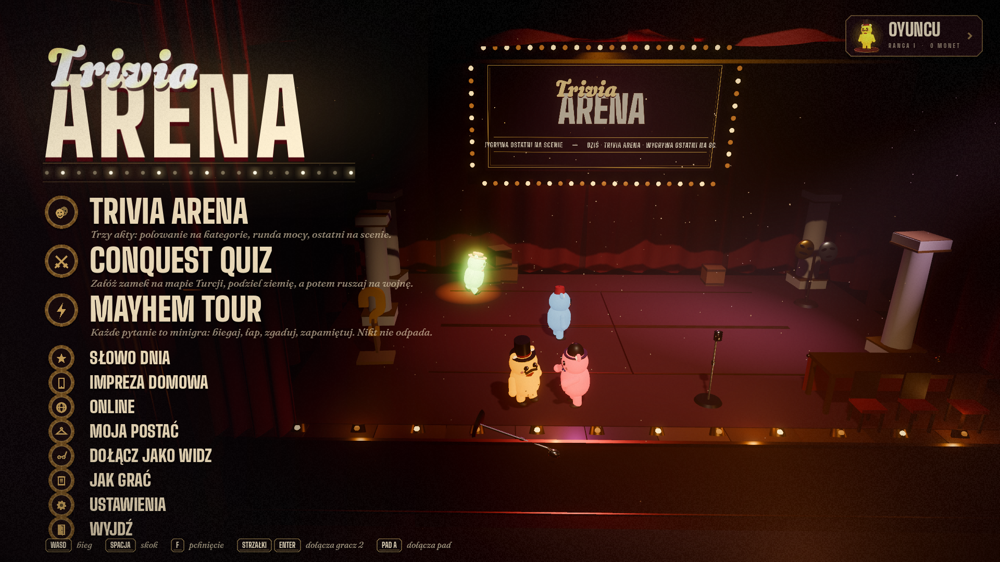
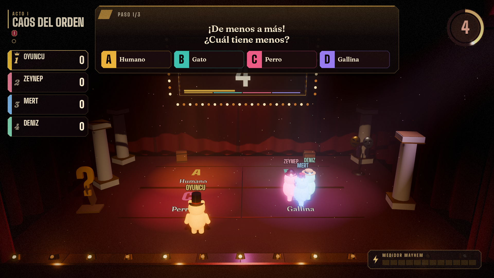
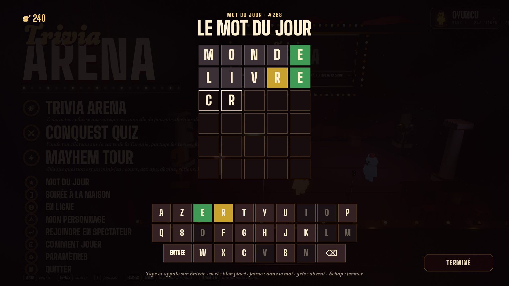

# Trivia Arena: The Grand Stage — Tasarım Belgesi

Web prototipi (`web-archive` dalı, `v1.0-web`) bir kavram kanıtıydı. Bu belge, oyunu fizik motoruyla beslenen kaotik bir 3D parti oyununa taşıyan tasarımın ve şu anki uygulamanın haritasıdır.

---

## 1. Atmosfer ve sahne kimliği: "The Grand Stage"

Lobi bir bekleme odası değil. Oyunun tonunu belirleyen, yaşayan bir tiyatro sahnesi.

| Tasarım maddesi | Uygulama (v0.1) | Dosya |
|---|---|---|
| Koyu bordo kadife halı | Hücresel gürültü normal haritası + kadife parıltısı (rim) | `stage/stage.gd` → `m_carpet()` |
| Kat kat ağır tiyatro perdeleri | Kodla üretilen kıvrımlı kumaş ağı: arka fon (2 kat), kulis kanatları (3×2), fistolu üst saçak, bağlı yan dökümler | `Stage.curtain_mesh()` |
| Önde açılıp kapanan ana perde | İki yarım, sahne geçişlerinde kapanır/açılır | `Stage.set_curtain()` |
| Loş, hacimsel ışık ve toz | Forward+ hacimsel sis, sisle etkileşen spotlar, 700 toz zerresi | `_build_environment`, `_build_lights`, `_build_dust` |
| Yaldızlı sahne ağzı | Lake sütunlar, yivli altın çubuklar, arma | `_build_proscenium` |
| Dev soru panosu | Ampullü çerçeveli pano; içerik bir SubViewport'a çizilen arayüz | `ui/board_screen.gd` |
| Ön ışık oluğu, seyirci koltukları, loca | Pirinç kapaklı ampuller (sırayla yanar), 110 koltuk, yan duvarda yaldızlı loca | `_build_floor`, `_build_audience`, `_build_balcony_box` |

### Etkileşimli dekorlar
Hepsi fizikli (`RigidBody3D`, `prop` grubu). Karakterler çarpınca devrilir, omuz atınca savrulur.

- Vintage ayaklı mikrofonlar (düşük ağırlık merkezi, yuvarlanır)
- Karton sütunlar (hafif, kolay devrilir)
- Dev karton soru işareti, komedi/trajedi maskeleri, sandıklar
- Jüri masası: sabit, üstüne zıplanabilir. Devrilen sandalyeleri ve çarpınca çalan pirinç zili var.

### Fizik ve karakter kaosu (Party Panic ekolü)
`actors/plush.gd`: `RigidBody3D` üzerine kurulu kuvvet tabanlı hareket.

- **Ayakta:** Dönme kilitli, ivmeli koşu (5,4 m/s), zıplama (~1,3 m), çakal zamanı ve zıplama tamponu var.
- **Omuz atma:** Önündeki koniye itme + küçük atılma. Denge azalır; denge biterse ya da %35 ihtimalle hedef devrilir.
- **Hızlı çarpışma:** 3,8 m/s üstü yaklaşma hızında karşıdaki sendeler ya da devrilir.
- **Devrilme ("ragdoll hissi"):** Kilitler açılır, gövde gerçekten yuvarlanır, kollar-bacaklar çırpınır. 1–1,6 sn sonra doğrulup kalkar (görünüş yumuşakça dikleşir).
- **Görünüş** (`actors/plush_visual.gd`): Keçe dokulu sarı pelüş, düğme gözler, dikişli gülüş, karın yaması, ayı kulakları. Yürüyüş salınımı, iniş sıkışması (yay), ivmeye gecikmeli kafa yayı ve göz kırpma var.

> Tam iskeletli ragdoll (PhysicalBone3D) v0.4 hedefidir. Şimdiki çözüm tek gövdenin gerçekten devrilmesi + prosedürel uzuv çırpınması. Oynanışta aynı komik hissi veriyor ve ağ senkronizasyonu çok daha ucuz.

---

## 2. Arayüz: tema aynı, dil yeni (v0.2)

İlk arayüz kodla çizilmiş ahşap panolar ve pirinç plaketlerdi; durağan ve "şablon" hissi veriyordu. Yeni arayüz aynı tiyatro temasını (kadife, pirinç, ampul) bir TV şovu grafik paketi gibi kullanır: sert, sıkışık başlıklar; zarif italik vurgular; her şey hareket eder.

**Tipografi** (`ui/fonts/*.tres`, FontVariation):
- **Big Shoulders Display 900:** başlıklar, isimler, sayılar. Dar, yüksek, afiş gibi.
- **Fraunces:** gövde metni ve sorular; italik siyah kesim el yazısı logoda ve kategori adlarında.
- Türkçe büyük harf kuralı (`Pal.upper`): i → İ, ı → I. Özel adlar (TRIVIA, QUIZ, SHIFT) korunur.

**Hareket** (`scripts/ui/fx.gd`): yaylı girişler, sıralı (stagger) belirme, vuruş, sarsıntı; `KineticText` harf harf düşen / neon gibi titreyerek yanan başlıklar; `RollingNumber` artışta yeşil, düşüşte kırmızı parlayan dönen sayılar.

**Shaderlar** (`ui/shaders/`): altın yüzeylerde kayan parıltı, kovalayan ampuller, halka sayaç, kadife perde (kıvrım + altın saçak), yumuşak spot + toz, film greni ve köşe karartması.

**Ekranlar:**
- **Lobi:** Soldan karartma; "Trivia" el yazısı + ampullü "ARENA" logosu (ampuller sırayla yanar, harfler titreyerek açılır). Menü satırları numaralı; üstüne gelince kadife ışık bandı süzülür, başlık kayar, altın ok belirir. Kurulumda logo çekilir, yerine gösteri başlığı, bot sayacı, zorluk/süre seçicileri ve altın "Perde açılsın" düğmesi gelir.
- **Profil kartı:** Bilet biçimi (oyuklu kenar, delikli koçan, seri no). Solda **canlı 3D pelüş portresi**: kendi küçük dünyasında spot altında nefes alır, göz kırpar, fareye bakar, arada zıplar; kostüm değişince anında giyinir. Karne sayıları döner. Beş dilli dil seçici (TR · EN · PL · FR · ES).
- **HUD:** sol üstte perde rozeti; solda skor şeridi (sıralama değişince kartlar yer değiştirir; can turunda gecikmeli erimeli can çubuğu; seri alevi; sabotaj simgeleri; +/− farkı uçar); üstte kategori renkli soru kartı (metin kelime kelime yazılır, şıklar yerdeki kapak renkleriyle aynı); sağ üstte halka sayaç (son 5 saniyede kırmızı ve vuruşlu); altta duyuru bandı.
- **Perde kartı:** kadife perde iner, Roma rakamı parlar, tur adı harf harf düşer, kural çipleri belirir.
- **Ödül seçici:** yelpaze gibi kartlar; seçili kart havaya kalkar. Kumanda, telefon ya da fareyle.
- **Final:** "Perde!", kazanan satırı taçlı, istatistikler (doğru, en iyi seri, çalınan puan), konfeti.
- **Kostüm odası, ev partisi, loca, afiş:** aynı panel dili; afiş krem kağıt, ipte sallanarak iner.
- **Sahnedeki pano:** lobide logo + kayan ilan; soru sırasında kategori ve dev geri sayım (okunacak metin HUD'da).

**Düzenlenebilirlik:** `scenes/main.tscn` sahne ağacı (Stage, Props, Camera, UI) editörde canlı önizlenir (`@tool`); `scenes/ui_gallery.tscn` arayüz parçalarını tek tek gösterir; renkler `pal.gd`, sayılar `data/rules.tres`.

---

## 3. Modlar

### Trivia Arena — üç perdelik klasik şov (`modes/classic_show.gd`)
Web sürümünün "matematiksel" soru sistemi, 3D bedenle:

1. **Kategori halatı** (her perde başında): sahneye üç kategori dairesi iner; dairede her zıplayış bir çekiş. İtişmek serbest. Kazanan kategori perdenin bütün sorularını belirler.
2. **Perde I · Kategori avı:** 4 soru (d1, d1, d2, d3). Süre bitince üstünde durduğun kapak cevabın. Kombo merdiveni 250 / 250 / 500 / 750.
3. **Perde II · Güç turu:** 4 soru (d1, d2, d2, d3). En hızlı doğru (doğru kapağa en erken girip orada kalan) ödül seçer: 400 puan soygunu ya da bir soruluk sabotaj (kurşun ayakkabı: yarı hız; ters kumanda; buz: kaygan ivme; dev kafa: en ufak omuzda devrilir).
4. **Perde III · Son ayakta kalan:** puan → can (taban: max(1000, liderin %35'i)). Bedel = round((100 + 40·t) · (1 + 2/N)) × ölçek; ölçek = masanın ortalama canı / 4500 (0,3–2,5). Yalnız en hızlı doğru kurtulur. Canı biten oyuncunun ayağının altında **kişisel bir kapak** açılır ve sahneyi delip düşer. En fazla 16 soru.
5. Kazanan karneye yazılır: galibiyet, Arena şampiyonluğu, seri.

Bütün sayılar `data/rules.tres`'te (RulesConfig kaynağı).

### Conquest — Bil ve Fethet (`modes/conquest_war.gd`)
Web sürümünün planı, sahneye serilen 3D bir Türkiye haritasında:

- **Harita** (`conquest/map_board.gd`, `data/maps/turkiye.json`): 16 bölge, gerçek il sınırları web sürümünden. Her bölge keçeden kesilmiş, kalın bir parça; kenarı bir ton koyu, üstünde beyaz iplik dikişi, içinde il sınırları ince koyu iplikle. Sahibi olunca parça onun rengine boyanır. Çevresi mavi saten deniz ve sığ su halesi; önde ve arkada eski tiyatroların dalga makinesi gibi sallanan boyalı dalga kesikleri; köşede pirinç pusula. 2× bölgelerin üstünde dönen altın para.
- **Kaleler** (`conquest/castle_model.gd`): altı üslup (Beyaz Balıkçıl, basamaklı piramit, Elhamra, masal şatosu, gotik katedral, bozkır otağı). Boyanmış ahşap/alçı maket hissi; kaide ve sancak oyuncunun renginde, pencerelerde sıcak ışık. 3 kule = 3 can: vurulan kule sallanıp devrilir, moloz ve toz kalır; tepede üç arma canı gösterir.
- **Taşlar** (`conquest/culture_costume.gd`, `conquest_piece.gd`): her bölgede sahibinin kültür kostümlü küçük pelüşü. Gövde klasik oyuncak ayı keçesi, kıyafet oyuncunun renginde. On kostüm: Viking, Romalı lejyoner, firavun, samuray, mariachi, silahşor, İskoç, yeniçeri, kanatlı hüsar, sınır avcısı. Oyuncuların kendi pelüşleri de maç boyunca aynı kostümle sahnenin önünde general gibi durur.
- **Perde I:** tek tahmin sorusu sırayı belirler; herkes boş ve başka kaleye komşu olmayan bir bölgeye kalesini kurar (1000 puan).
- **Perde II:** tahmin sorularında en yakın 2, ikinci 1 bölge alır (sınırına komşu); bölge 200, 2× bölge 400.
- **Perde III:** savaş turu sayısı = 16 / oyuncu sayısı (2–6). Sırayla komşu bir düşman bölgesine saldırılır; saldırı yayı (renkli ışık topu) haritada uçar. Saldıran ve savunan aynı 4 şıklı soruyu cevaplar; yalnız saldıran bilirse bölge ve değeri kadar puan geçer; ikisi de bilirse tahmin sorusu ayırır. Kaleye vurmak bir kule düşürür; son kule düşünce kale çöker, bütün toprak ve puan fatihe geçer.
- **Girdi:** tahmin cetveli (`hud/estimate_panel.gd`): min–max aralığında pirinç cetvel, geniş aralıkta logaritmik. Sol/sağ sancağı ivmeyle kaydırır (değer 3 anlamlı basamağa yuvarlanır), yukarı/aşağı büyüklüğe göre ince ayar, zıpla çakar, omuz kilidi açar; klavyeden yazma, fareyle sürükleme. Telefona sayı klavyesi (`{t:"mode", m:"num"}` → `{t:"num", v, lock}`), düelloda şık düğmeleri (`m:"abcd"` → `{t:"ans", i}`). Telefon ve bot tahminleri açıklamaya kadar gizli; açıklamada altın iğne cevaba düşer, mesafe çizgileri uzar.
- **Kamera:** genel bakış (proscenium kirişinin içinden), seçimde tepeden, saldırıda iki bölgeye yakın, düelloda orta plan, kale düşüşünde yörünge çekimi (`BalconyCam.set_custom` + `orbit`). Generaller maçta gizli; sol sütunda kostümlü canlı portreli sancak kartları (`hud/war_rail.gd`), düello açılışı (`hud/duel_splash.gd`), finalde selam.
- **Ses:** müzikler ve orkestral efektler `tools/music/compose.py` ile notadan üretilir (`assets/audio`); `Music` autoload'ı parçalar arasında geçiş yapar (soru = gerilim yatağı).

### İlerleme ve kozmetik (v0.4)
- **Sahne Rütbesi** (`core/progress.gd`, statik): 30 seviye. `xp_for(n) = Σ(120 + 30k)`. Maç sonunda `Progress.award(rank, stats, kind)` bir döküm üretir, sonuç ekranındaki `hud/rank_panel.gd` bunu canlandırır. `begin_match()` maç başındaki kilit durumunun anlık görüntüsünü alır. Böylece maç içinde başarımla açılanlar da "Yeni açılanlar"da görünür.
- **Kilitler:** `FREE`, `LEVEL_UNLOCKS` ve `ACH_UNLOCKS` tabloları. Karakterim'de kilitli öğe gezilebilir ama giyilemez: asma kilit, soluk ad ve şart gösterilir.
- **Tur çubuğu** (`hud/round_track.gd`): perde pipleri ile perdeye göre değişen bir ilerleme gösterir.
  - Conquest tahmin turları: ipte bayraklar, her turda biri boyanır.
  - Toprak: sahip rengindeki 16 altıgen.
  - Savaş: kaleler.
  - Trivia: soru noktaları.
- **Modeller:**
  - Kaleler: taş (`ui/shaders/stone.gdshader`) ve kiremit (`roof_tiles.gdshader`) prosedürel shaderları, iki yeni üslup (soğan kubbe, deniz feneri) ve oyuncunun sancak deseni (`CastleModel.banner_texture`).
  - Pelüşler: keçe kenar ışığı, 10 yeni şapka, 5 bıyık/sakal, 6 boyun aksesuarı, 7 gözlük, 8 renk.
  - Kültürler: şövalye, korsan (papağan, kanca) ve kâşif.

### Mayhem Turu (`modes/mayhem_tour.gd`, v0.5)
"Trivia Mayhem" GDD'sinin MVP'si, aynı Büyük Sahne'de. GDD'den eşleşenler ve farklar:

| GDD | Bu oyunda |
|---|---|
| Four Doors | Dört kapak. Yanlış kapak oyuncuyu fırlatır (`_launch`) |
| Zoom Panic | `hud/mayhem_overlay.gd` içinde ayrı dünyalı SubViewport. FOV üstel olarak 4°→24° açılır; hız bonusu ×2 |
| Nearest Wins / Crowd Guess | Sahne sayı doğrusu (`mayhem/number_line.gd`, geniş aralıkta logaritmik). Tahminler herkesin başının üstünde görünür |
| Order Chaos | Telefonda sürükleme yerine adım adım seçim (3 adım, kullanılan kapak "✓") |
| Sound Hunt | 19 telif dışı melodi + 15 gündelik ses, hepsi sentez. Soru adı ya da besteciyi sorar |
| Falling Answers | Harf ve renkli bloklar düşer. Yanlış blok ve dev SAHTE blok sersemletir |
| Memory Panic / Don't Get Fooled | 1. tur: nesneler kaybolur. 2. tur: kutulara girip 3–4 kez yer değiştirir |
| Final Mayhem | 6 × 8 sn: D/Y, kapı, zoom, tahmin, ses, D/Y; ×1.5 |
| Mayhem Meter + Chaos Events | Metre sağ altta. Olaylar: buz, dev kafa, ters kumanda, minikler, kaçan cevaplar |
| Comeback | Joker ×2 (sonuncu, 150+ puan geride) |
| No elimination | Kimse düşmez; sahneden düşen kulisten döner |
| Reveal system | Seçimler kafaların üstünde → "Ve doğru cevap…" + davul → patlama + sunucu yorumu |
| Winner ceremony | 8 ödül, herkese bir tane; sonuç ekranında yıldızla |
| Reactions | Telefonda 6 tepki düğmesi (`rx` mesajı, 0,7 sn sınır) |

Henüz yok (GDD'nin sonraki fazları): çevrimiçi analitik ve soru metrikleri, günlük görevler, aile filtresi, renk körlüğü şekilleri, soru kaynağı/doğrulama alanları, soru editörü.

### Günlük Kelime, jeton ve mağaza (v0.6)
- **`core/daily_word.gd`:**
  - Gün numarası 2026-01-01'den sayılır. Cevap: `answers[gün % n]`, karışık ama sabit sıra.
  - Değerlendirme Wordle kurallarıyla yapılır; tekrar eden harfler doğru sayılır.
  - Durum `Profile.data.daily` içinde, dile göre ayrı tutulur. Seri iki dilde tek sayılır.
- **Jeton (`Profile.data.coins`):**
  - Günlük Kelime'den ve maç sonundan kazanılır; maç sonu kazancı rütbe panelinde "+N" olarak görünür.
  - `Progress.buy()` öğeyi `owned` listesine yazar.
  - Fiyatlar: rütbe öğesi 60 + 14×seviye, başarım öğesi 350; mağazaya özel öğelerin fiyatı sabittir.
- **Karakterim:** kilitli öğe `preview_look` ile kaydedilmeden giydirilir, panel kapanınca geri alınır.
- **Giysiler (`actors/plush_extras.gd`):**
  - Kıyafet kılıfları gövde kapsülünün profilini izleyen dönel yüzeylerdir (`lathe`); kenarlara dikiş şeridi eklenir.
  - Kolyeler boynu önden saran yay üzerine dizilir (`neck_arc`).
  - Gözlükler yüzün eğrisine açılı durur ve kulağa giden sapları vardır.
  - Pelerin, arkada kalan kavisli bir yüzeydir.

### Soru bankası
`tools/questions/packs/*.txt` satır başına bir soru içerir: `kategori|zorluk(1-3)|TR|EN|doğru|yanlış|yanlış|yanlış`. Şık `tr~en` biçiminde iki dilde yazılabilir. Tahmin satırlarının biçimi `E|cevap|min|max|yıl|TR soru|birim|EN soru|unit`. `build_pack.py` bu paketleri tekrarları ayıklayıp `data/questions.json`'a ekler.

Banka yaklaşık 2000 soru ve 98 tahmin sorusundan oluşur. 15 kategori var, bunların arasında Uzay, Tuhaf ama Gerçek ve Diller ve Kelimeler yeni. Sorular evrenseldir, İspanyol ve Polonyalı oyuncular için de yerel dokunuşlar içerir.

### Diller
Oyun beş dilde oynanır: Türkçe, İngilizce, Lehçe, Fransızca, İspanyolca. Arayüz, 2135 soru, 98 tahmin sorusu, Mayhem sıralama setleri ve ses adları, kategori adları, başarımlar, Günlük Kelime (dile özel sözlük ve klavye: Lehçe harf sırası, Fransızca AZERTY, İspanyolca Ñ), anlatıcı sesi (MBROLA pl1/fr1/es2) ve telefon kumandası hepsi çevrilidir. Sayılar dile göre biçimlenir: TR/ES `150.000`, PL/FR `150 000`, EN `150,000`; ondalık virgül EN dışında. Bir çeviri eksikse metin İngilizceye düşer. Soru çevirilerinde şıklar İngilizcedeki sırayla yazılır, böylece doğru cevabın yeri bütün dillerde aynı kalır.





### Dayanıklılık
- **Profil:** sürümlü göç (`_migrate`), geçici dosya → yedek → yer değiştirme sırasıyla atomik kayıt, bozuk dosyada yedekten kurtarma.
- **`ErrorReporter`** (ilk autoload):
  - `OS.add_logger` ile motor hatalarını halka tampona alır.
  - Oturum kilidi ile çökmeyi algılar. Kilit kalmışsa, `user://logs` içindeki son günlükten `user://reports/crash-*.txt` üretir.
  - Hatalı oturumun raporunu kapanışta yazar.
  - Raporlar yereldir, bir yere gönderilmez.

---

## 4. Oyuncular ve bağlantı

| Mod | Durum |
|---|---|
| Yerel: 2 klavye seti + gamepad'ler | ✅ WASD/Boşluk/F · Oklar/Enter/Sağ Shift · gamepad (Ⓐ zıpla, Ⓧ/Ⓑ omuz). Katılmak için tuşa basmak yeterli. |
| Botlar | ✅ Kolay/Normal/Zor. Soruyu okuma süresi, isabet, kararsızlık ve kaos için omuz atma var. |
| **Ev partisi (QR + telefon kumandası)** | ✅ Tek ekran; telefonlar QR ile `/pad` sayfasını açar: sanal joystick, ZIPLA, OMUZ, titreşim. Sunucu: `server/`. |
| Steam online (lobiler, Remote Play Together) | ⏳ v0.4. Hareket girdi ile sürüldüğü için ağ katmanı kontrolcü arayüzünün arkasına takılacak. |

### Ev partisi mimarisi
```
 Telefon (pad.html) ──WS──▶ server/ (Node, ws) ──WS──▶ Oyun (PhoneBridge)
   joystick x,y + tuşlar        oda kodu, aktarım          Controllers.Phone → Plush
   ◀── renk, durum, "elendin", titreşim ─────────────────  notify_player / notify_phones
```
- Telefon girdisi saniyede 30 kez gider. Kısa dokunuşlar mandallanır; oyun basışı karede yakalar.
- Sahne koparsa sunucu odayı 30 sn bekletir ve aynı kodla geri bağlanılır. Telefon koparsa 20 sn içinde aynı koltuğa döner.
- QR, sunucunun `/qr.png` ucundan gelir.

---

## 5. Kamera

`camera/balcony_cam.gd`: İzometrik değil; hafif geniş açılı (44–50°), sahneyi balkondan görür.

- **Cinematic sway:** Aktif oyuncuların ağırlık merkezine yavaşça kayar.
- **El kamerası nefesi:** Gürültü tabanlı hafif salınım.
- **Sarsıntı (trauma):** Kapak açılışında ve büyük ödülde.
- **Kadrajlar:** Lobi (sol pano için sağa kaydırılmış), Arena, Kostüm odası, Loca (sahneye bağlı özel kadraj).

---

## 6. Teknik yol haritası

| Sürüm | İçerik |
|---|---|
| `v1.0-web` | Web prototipi (`web-archive` dalı). Render'da canlı. |
| `v0.1.0-3d-stage` | Büyük Sahne, pelüş fizik, diegetik arayüz, Trivia Arena (eleme), Conquest Quiz, Ev partisi, 47 başsız test |
| v0.2 | Klasik şov (web kuralları), yeni arayüz (kinetik tipografi, shaderlar, canlı 3D portre), düzenlenebilir sahne ağacı, 63 başsız test |
| v0.3 | Gerçek sanat: pelüş karakter modeli + kumaş dokuları, tiyatro dekor modelleri, müzik, gamepad ile menü gezinme, ayarlar (ses, görüntü kalitesi) |
| v0.4 | Sahne Rütbesi ve 46 açılabilir öğe, tur çubuğu, ~2000 soru, taş/kiremit shaderları, kayıt dosyası dayanıklılığı, hata raporu |
| v0.5 | Mayhem Turu: 8 mini oyun, Mayhem Metre, kaos olayları, ödül töreni, telefon tepkileri |
| **v0.6 (bu sürüm)** | Günlük Kelime + jeton + mağaza, 33 yeni giysi (kolye, kıyafet, şapka, gözlük), Mayhem kapıları ve tahmin girişi, eğlenceli kategoriler + 3 yeni kategori |
| v0.7 | Online: sunucu-yetkili fizik + istemci interpolasyonu (ENet → SteamMultiplayerPeer), Steam lobileri, loca sohbeti, iskeletli ragdoll |
| v0.8 | Steamworks: başarımlar, bulut kayıt, mağaza sayfası, Remote Play Together testleri |

### Performans notları
- Hacimsel sis ve gölgeli spotlar Forward+ gerektirir. Zayıf makineler için "Sade" kalite ayarı (v0.3) sisi ve ikincil gölgeleri kapatacak.
- Toz partikülleri GPU'da; dekorlar az çokgenli ve paylaşılan malzemeli.
